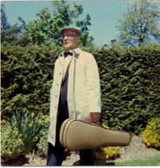

**CAARA has held the club call sign W1GLO since May 31, 2007.** Prior to
that, there was only one known holder of that call sign. His name was
Frederick J. DiLucci and he lived in Fitchburg, MA.

**Frederick J. ‘Fred’ DiLucci** was born on August 12, 1922, in Fitchburg,
MA, and lived there all of his life. We believe he was issued the call sign
W1GLO sometime in 1956 or 1957 however we do not know if this was his first
Amateur Radio call sign. He was a musician and decorated Army vet. Fred
attended school in Fitchburg and was a graduate of Fitchburg High School.

::: figure-right

:::

In 1942, he enlisted in the U.S. Army. He participated in the battles of
Normandy, Northern France, the Rhineland, and Ardennes. He received a
[Bronze Star Medal](https://en.wikipedia.org/wiki/Bronze_Star_Medal) and
[Distinguished Unit Citation](https://en.wikipedia.org/wiki/Presidential_Unit_Citation_(United_States)).
He was honorably discharged in 1945.

In 1948 Mr. DiLucci graduated from the
[New England Conservatory of Music](https://necmusic.edu/) in Boston with a
Bachelor Degree in Music.

Fred worked for the U.S. Postal Service and retired from there many years
ago. He shared a real love and passion for classical music which, over the
years, he shared with his many friends and family. As an accomplished
musician, he played the Viola for the
[Thayer Symphony Orchestra](https://newenglandsymphony.org/)
in Leominster, MA for 15 years, and was active in the music field for over
60 years. He was a member of the Fitchburg Lodge of Elks #847 from 1950
until 1980 and was a longtime member of
[St. Anthony De Padua Church](https://stanthonyfitchburg.net/). He was also
a member of the [Montachusett Amateur Radio Association](https://w1gz.org/)
in Fitchburg, MA.

Fred passed away on October 4, 2008.
