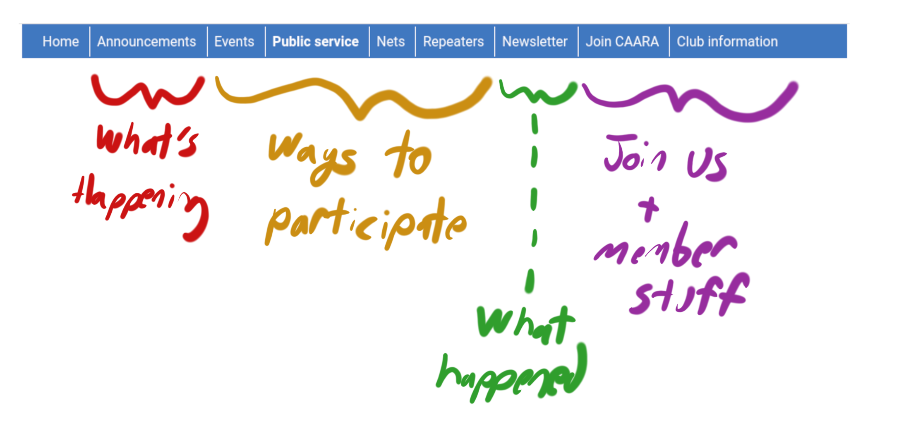
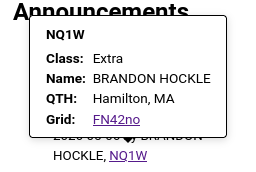

## Responsive design

The site displays well on both large and small screens. Below a certain threshold, the navigation menu collapses to a "hamburger" menu (three horizontal lines), and the announcements sidebar on the main page relocates to beneath the main content. The font size is appropriate to the screen size.

The site is designed to be printable: elements like navigation menus and clickable links are excluded when printing. That means that in almost all cases, there is no need to provide a separate link for a "printable" version of a page.

## Navigation menu

I had two goals for the navigation menu:

1. Reduce it to a single line, rather than the five-line monstrosity on the current site.
2. Emphasize participation.

We start with an announcements page, which serves both to show what an active and interesting club we are and provide information about upcoming events and activities.

Next is the event calendar, which is all about when and where.

These are followed by a public service page, information about our radio nets, and information about our repeaters -- all of these are broadly ways in which people can engage with us.

These are followed by the newsletter, which documents things that have already happened. Again, look at all the interesting things we do!

Finally, we have the administrative section: how to join the club, after seen all the exciting bits earlier in the menu, and finally club information, which includes administrative documents, silent key tributes, historical documents, and so forth.

## Interactive elements

It is possible to annotate callsigns so that hovering the mouse over one displays a popup with information retrieved from the FCC license database.

## Data driven content

Many pages are effectively "lists of items":

- The news posts on [/announcements](/announcements/)
- The silent key tributes at [/about/silent-key](/about/silent-key/)
- The list of links in the navigation menu
- The list of newsletters at [/newsletter](/newsletter/)

These pages are all generated automatically by iterating over the relevant items. This same feature also lets us easily generate a news feed from the list of announcements (see [/feed.xml](/feed.xml)).
